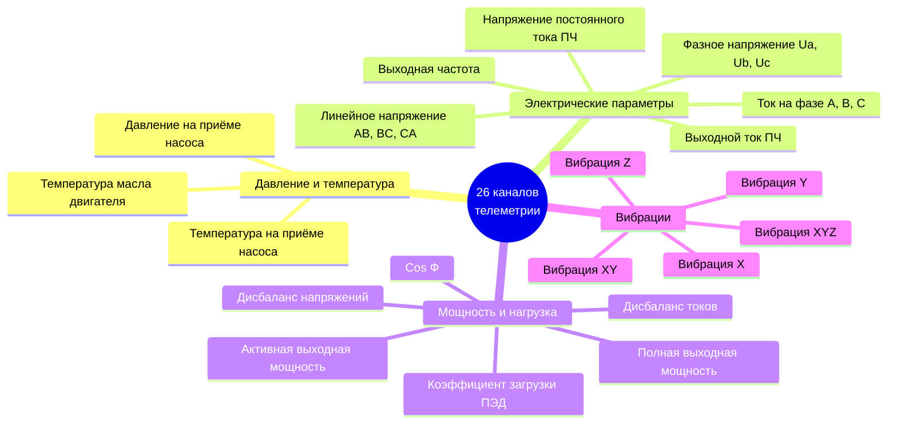
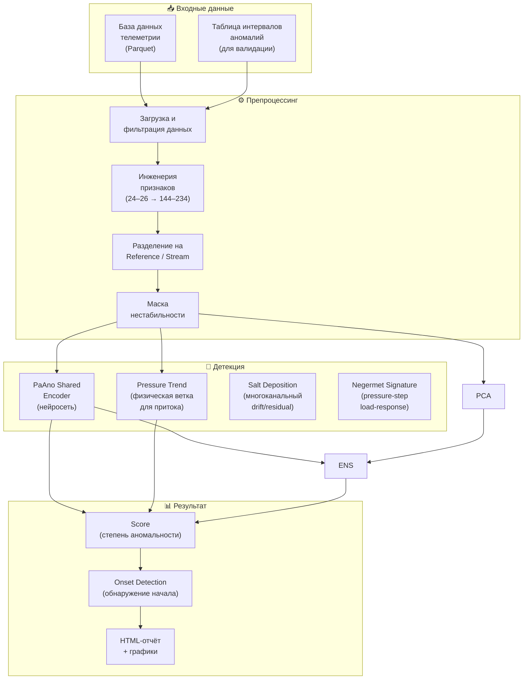
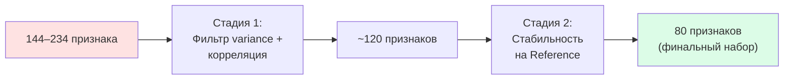
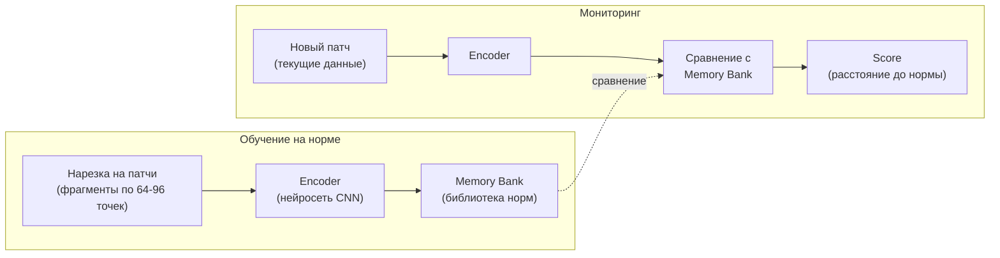
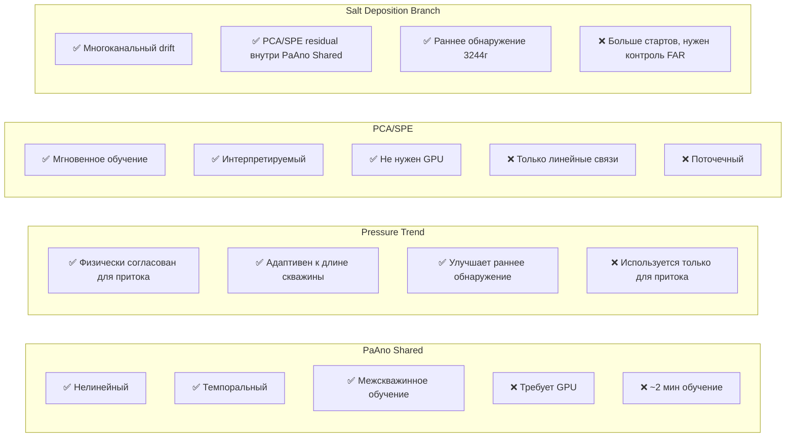
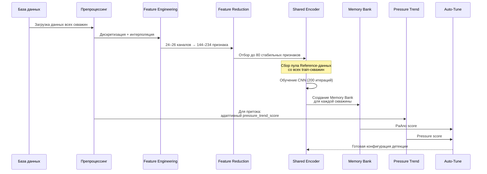
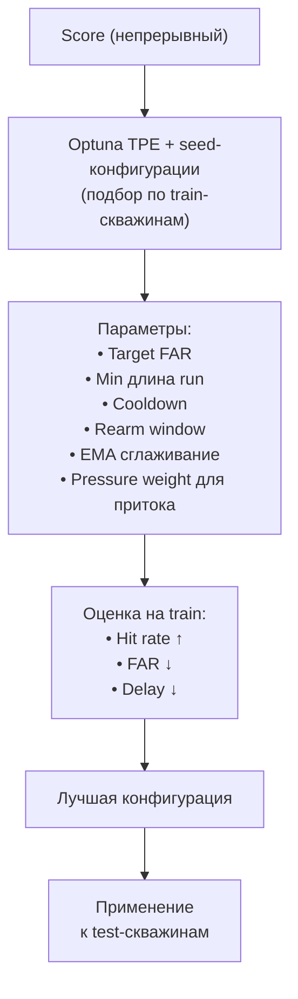
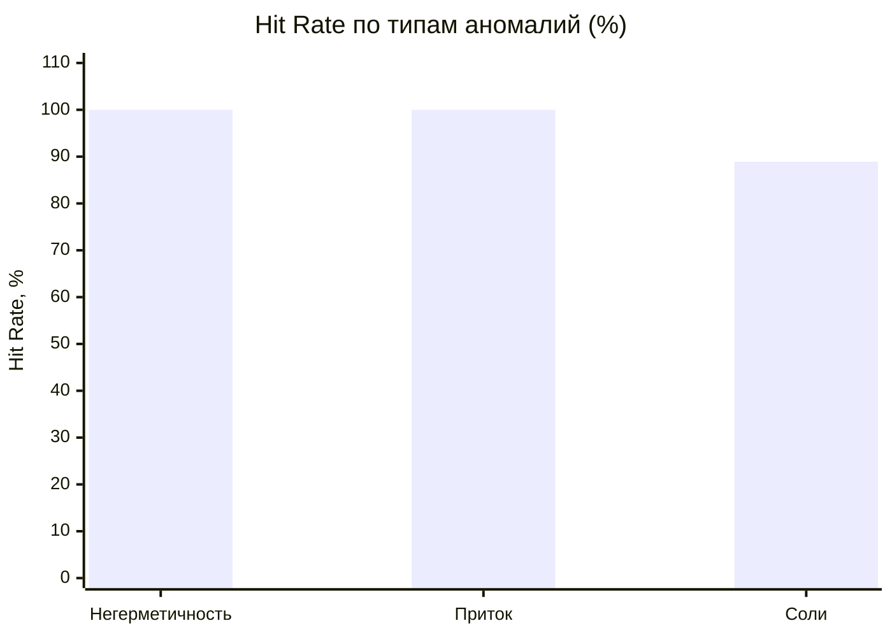

# ALMA — Система раннего обнаружения аномалий в работе скважинного оборудования

## 📋 Содержание

1. [Задача и мотивация](#1-задача-и-мотивация)
2. [Какие аномалии обнаруживаем](#2-какие-аномалии-обнаруживаем)
3. [Данные: что используем](#3-данные-что-используем)
4. [Архитектура системы](#4-архитектура-системы)
5. [Алгоритмы детекции](#5-алгоритмы-детекции)
6. [Как система обучается](#6-как-система-обучается)
7. [Как система выдаёт результат](#7-как-система-выдаёт-результат)
8. [Результаты и метрики качества](#8-результаты-и-метрики-качества)
9. [Отчёты и визуализация](#9-отчёты-и-визуализация)
10. [Как запустить](#10-как-запустить)
11. [Глоссарий](#11-глоссарий)

---

## 1. Задача и мотивация

### Проблема

Скважинное оборудование (ЭЦН — электроцентробежные насосы) работает в тяжёлых условиях. Периодически возникают **аномалии** — отклонения от нормальной работы, которые, если их вовремя не заметить, приводят к:

- ⚠️ **Аварийным остановкам** — простой скважины = потеря добычи
- 💰 **Дорогостоящему ремонту** — замена оборудования на глубине стоит миллионы рублей
- 🔧 **Потере ресурса оборудования** — раннее обнаружение позволяет плановый ремонт вместо аварийного

### Решение

Система **ALMA** анализирует телеметрию скважины (показания датчиков) в режиме реального времени и **автоматически обнаруживает аномалии на ранней стадии** — до того, как произойдёт авария.

```
┌──────────────┐     ┌───────────────┐     ┌──────────────────┐     ┌──────────────┐
│  Датчики     │────▶│  База данных  │────▶│  Алгоритм ALMA   │────▶│  🚨 Алерт    │
│  скважины    │     │  телеметрии   │     │  (AI-детекция)   │     │  инженеру    │
└──────────────┘     └───────────────┘     └──────────────────┘     └──────────────┘
     26 каналов          10-15 мин              < 1 мин               мобильное
    каждые 15-45с       дискретизация          обработка              уведомление
```

### Ключевое преимущество

Система **не требует разметки аномалий для обучения**. Она обучается на **нормальных** данных (период стабильной работы скважины) и затем детектирует **любые отклонения** от нормы. Это принципиально отличает подход от классической классификации.

---

## 2. Какие аномалии обнаруживаем

Система обучена детектировать **три типа аномалий**:

| Тип аномалии | Описание | Физика процесса | Скорость развития |
|---|---|---|---|
| 🔴 **Негерметичность НКТ** | Нарушение целостности насосно-компрессорных труб | Утечка жидкости из трубы → падение давления, изменение токов | Часы |
| 🟠 **Изменение притока** | Изменение объёма поступающей из пласта жидкости | Изменение дебита → смещение рабочей точки насоса | Дни — недели |
| 🟢 **Солеотложение** | Отложение солей на рабочих органах насоса | Постепенное засорение → рост нагрузки, изменение вибраций | Недели — месяцы |

Каждый тип аномалии имеет свои **характерные паттерны** в телеметрии и **разную скорость развития**, что учитывается при настройке алгоритма.

---

## 3. Данные: что используем

### 3.1 Источник данных

Данные поступают из **системы телеметрии скважин** — каждая скважина оснащена набором датчиков, которые передают показания с определённой периодичностью.

Рабочие датасеты для детекции хранятся в Parquet:

| Класс | Основной файл данных | Интервалы разметки |
|---|---|---|
| Негерметичность | `db/negermet_anomaly_database_2min.parquet` | `db/negermet_intervals.parquet` |
| Приток | `db/pritok_anomaly_database_10min.parquet` | `db/pritok_intervals.parquet` |
| Солеотложение | `db/salt_anomaly_database_15min.parquet` | `db/salt_intervals.parquet` |

Для притока после последнего расширения набора данных используется 27 скважин: 24 скважины с аномалией «Изменение притока» и 3 скважины с нормальным поведением (изменение частоты без аномалии). Данные собираются на 10-минутной сетке в файл `db/pritok_anomaly_database_10min.parquet`. Шаг дискретизации притока (10 минут) обязан совпадать с шагом, на котором обучен и запускается детектор: при несовпадении сетки часть скважин теряет каналы и не обрабатывается.

### 3.2 Каналы телеметрии (26 датчиков)

Все датчики можно разделить на **четыре группы** по физическому смыслу:



### 3.3 Частота обновления данных

**Важный нюанс:** датчики обновляются с **разной частотой**:

| Группа каналов | Частота обновления | Примеры |
|---|---|---|
| **Быстрые** (< 45 сек) | Каждые 15–30 секунд | Вибрации X, Y, Z |
| **Средние** (1–5 мин) | Каждые 1–3 минуты | Токи, напряжения, мощность |
| **Медленные** (> 5 мин) | Каждые 5–15 минут | Температура, Cos Ф, давление |

Для унификации данные **дискретизируются** к единой сетке:
- **Негерметичность:** 2-минутная сетка (быстрый процесс)
- **Приток:** 10-минутная сетка (медленный процесс)
- **Соли:** 15-минутная сетка (очень медленный процесс)

### 3.4 Обработка пропусков

Медленные каналы часто содержат пропуски между обновлениями. Система использует **линейную интерполяцию** — пропущенные значения заполняются плавной линией между известными точками, а не ступеньками. Это физически корректнее: температура не может мгновенно измениться.

```
До обработки:    25°C  ___  ___  ___  30°C    (ступеньки ffill)
                  25    25   25   25   30

После обработки:  25°C                30°C    (плавный переход)
                  25   26.25 27.5 28.75 30
```

---

## 4. Архитектура системы

### 4.1 Общая схема



### 4.2 Разделение данных: Reference и Stream

Ключевая концепция системы — разделение временного ряда на две части:

```
     ◄──── Reference (норма) ────►◄──────── Stream (мониторинг) ────────►
     ┌────────────────────────────┬──────────────────────────────────────┐
     │    Стабильная работа       │   Здесь может быть аномалия         │
     │    (обучение модели)       │   (здесь модель ищет отклонения)    │
     └────────────────────────────┴──────────────────────────────────────┘
     t₀                        t_ref                                   t_end
```

- **Reference** — период гарантированно нормальной работы (первые 20–40% данных). На нём модель «запоминает» норму.
- **Stream** — остальные данные. Модель сравнивает каждую точку с нормой и выдаёт **score** (степень аномальности).

### 4.3 Инженерия признаков

Из 24–26 «сырых» каналов система создаёт **144–234 производных признаков** (features), которые лучше отражают динамику процесса:

| Тип признака | Описание | Пример |
|---|---|---|
| **Скользящее среднее** | Средний уровень за окно | `Давление::mean_60` |
| **Скользящее std** | Волатильность за окно | `Вибрация_X::std_30` |
| **Скользящий min/max** | Экстремумы за окно | `Ток_А::max_120` |
| **Межканальные** | Отношения между каналами | `Мощность / Ток` |

Размеры окон адаптированы к **скорости аномалии**: для негерметичности — короткие окна (быстрый процесс), для солей — длинные (медленный процесс).

### 4.4 Отбор признаков (Feature Reduction)

До 234 признаков — это избыточно. Система использует **двухстадийный отбор**:



1. **Стадия 1:** Убираем каналы с нулевой дисперсией (константы) и сильно коррелированные (дубликаты).
2. **Стадия 2:** Оцениваем «стабильность» каждого канала на Reference-данных. Оставляем **80 наиболее стабильных** — именно они дадут чёткий сигнал при аномалии.

---

## 5. Алгоритмы детекции

Система использует **три базовых алгоритма** и одну специализированную физическую ветку для притока:

### 5.1 PaAno Shared Encoder (основной)

**PaAno** (Patch-based Anomaly detection) — это **нейросетевой** алгоритм, основанный на научной статье.

#### Принцип работы (простым языком):



1. **Разрезаем** данные на «патчи» — фрагменты фиксированного размера (например, 64 точки = ~10 часов для солей при 15-мин сетке)
2. **Обучаем нейросеть** (encoder), которая сжимает каждый патч в компактный вектор (embedding)
3. **Сохраняем** embeddings всех нормальных патчей в **Memory Bank** (банк памяти)
4. **При мониторинге:** для каждого нового патча считаем embedding и измеряем **расстояние** до ближайших соседей в Memory Bank
5. **Чем дальше от нормы** — тем выше score — тем больше вероятность аномалии

#### Почему «Shared Encoder»?

Ключевая идея: **один encoder обучается на данных всех скважин сразу.** Это даёт:
- 📈 Больше данных для обучения (даже если по одной скважине данных мало)
- 🔄 Обобщение — модель «видит» общие паттерны нормальной работы
- 🎯 Лучшее различение нормы и аномалии

#### Двухмасштабная архитектура

Используем **два размера патча** одновременно:

| Масштаб | Размер патча | Что ловит |
|---|---|---|
| **Короткий** (32–96 точек) | Локальные изменения | Резкие скачки, быстрые аномалии |
| **Длинный** (64–192 точек) | Глобальные тренды | Медленные деградации, тренды |

Финальный нейросетевой score = взвешенная комбинация двух масштабов.

### 5.2 Pressure Trend для притока

Для аномалии **«Изменение притока»** к `paano_shared` добавлена отдельная физическая ветка по каналу **«Давление на приеме насоса кгс/см²»**. Это не новый детектор и не отдельный отчёт: ветка работает внутри `paano_shared` и усиливает score только для притока.

Зачем это нужно:

- приток физически часто проявляется как устойчивый тренд давления на приёме;
- нейросетевой PaAno хорошо ловит многоканальные паттерны, но может поздно реагировать на слабый, но физически значимый тренд давления;
- отдельная pressure-ветка делает алгоритм чувствительнее к началу притока, сохраняя общий PaAno-score и прежний формат отчётов.

Как строится `pressure_trend_score`:

1. Берётся reference-период каждой скважины.
2. По давлению считаются robust baseline и scale: median/MAD, а не среднее/std.
3. Автоматически выбираются несколько временных горизонтов относительно длины ряда и reference-периода.
4. Для каждого момента оцениваются уровень давления, изменение относительно baseline, устойчивость тренда и практическая значимость сдвига.
5. Эти компоненты объединяются в `pressure_trend_score`.

Финальный score для притока:

```text
score = paano_score + pressure_trend_weight × pressure_trend_score
```

`pressure_trend_weight` подбирается auto-tune. В финальном прогоне притока выбран вес `0.0025`, то есть pressure-ветка не заменяет PaAno, а мягко подталкивает score в местах физически согласованного тренда.

В HTML-отчёте по притоку score-график показывает общий score и дополнительные линии `paano_tail_score` / `pressure_trend_score`, чтобы было видно, какая часть сигнала пришла от PaAno, а какая — от давления.

### 5.3 PCA/SPE-подобный residual внутри salt branch

Отдельного production-детектора PCA/SPE больше нет. Его сильная часть
используется внутри `salt_deposition`: многомерная ошибка восстановления
показывает, что группа каналов перестала согласованно вести себя как reference.

#### Принцип работы (простым языком):

```
Норма: все каналы изменяются согласованно (по определённым "осям")

PCA находит эти оси → проецирует данные → восстанавливает обратно

Если данные нормальные: восстановление точное (ошибка мала)
Если аномалия: восстановление неточное (ошибка велика) → 🚨
```

Два показателя:
- **T² (Hotelling)** — насколько данные отклонились вдоль главных осей
- **SPE** — ошибка восстановления (residual) — насколько данные «не ложатся» в модель нормы

В production это не отдельный detector key, а компонент
`salt_deposition_calibrated_fusion_score`.

### 5.4 Physical Branches внутри PaAno Shared

После унификации финальная архитектура для основных классов строится как:

```
Score_final = Score_PaAnoShared + tuned_weight × Score_PhysicalBranch
```

Вес физической ветки подбирается только на train-скважинах. Test-скважины не
используются для подбора веса, порогов и задержек.

Физические ветки разные по смыслу, но одинаковые по каркасу:

- **Приток**: `pressure_trend` по давлению на приеме насоса.
- **Негермет**: `negermet_signature` как pressure-step/load-response диагностика.
- **Соли**: `salt_deposition` как многоканальный grouped drift + PCA/SPE residual + KS shift.

Для соли сильная часть старого ансамбля перенесена внутрь `paano_shared`:
PCA/SPE-подобный residual теперь работает как
`salt_deposition_calibrated_fusion_score`, а не как отдельный detector key.

Для негермета `negermet_signature` уже подключен к `paano_shared` как
диагностическая pressure-step/load-response ветка. Ее вклад в итоговый score
задается `negermet_signature_weight` и подбирается train-only; если ветка не
улучшает метрики, tuning может оставить вес `0`, сохранив поведение чистого
PaAno Shared.

### 5.5 Сравнение алгоритмов



---

## 6. Как система обучается

### 6.1 Процесс обучения (для одного типа аномалии)



### 6.2 Разделение скважин

Скважины делятся на **train** и **test**:
- **Train** — скважины, на которых настраивается порог срабатывания
- **Test** — скважины для проверки (алгоритм их «не видел» при настройке)

Encoder обучается **только на train-скважинах**, но затем применяется ко всем.

### 6.3 Автоматическая настройка порогов (Auto-Tune)

После получения score для каждой точки, система **автоматически подбирает оптимальные пороги**:



Подбираются параметры:
- **Target FAR** — целевой уровень ложных срабатываний на reference-периоде
- **Min run points** — сколько подряд точек должны быть выше порога
- **Cooldown** — пауза между повторными алертами; для притока используются более длинные окна, потому что процесс длится днями и неделями
- **Rearm window** — окно, после которого разрешается новый старт при новом устойчивом превышении
- **EMA alpha** — сглаживание score для устойчивости
- **Pressure trend weight** — вес физической pressure-ветки для притока

Для притока дополнительно запрещён режим мгновенного обхода cooldown после clear (`bypass_cooldown_after_clear=False`). Это снижает дробление одной длинной аномалии на десятки повторных стартов.

### 6.4 Production-candidate `paano_global`

После серии экспериментов в кодовой базе оставлены два сильных PaAno-подхода:

| Детектор | Роль | Статус |
|---|---|---|
| `paano_shared` | текущий production/default | используется в основных отчетах |
| `paano_global` | общий encoder нормальности | production-candidate, не default |

`paano_global` обучается на общей 5min-схеме по размеченным `negermet`,
`pritok`, `salt` и подтвержденной норме `norm_work`. Для коротких рядов
используется безопасный input contract `edge_hold + local memory`; невозможная
оценка помечается как `Not assessed`, а не как нулевой score. Поверх candidate
starts работает domain decision layer: он объясняет, принят старт, подавлен как
режимное событие/плохие данные или отправлен в review.

`paano_global` держится рядом с `paano_shared`, но переключение default должно
быть отдельным решением после review.

---

## 7. Как система выдаёт результат

### 7.1 От score к алерту

```
Сырой score     ─────▶  EMA-сглаживание  ─────▶  Пороговая логика  ─────▶  Алерт
(каждые N мин)          (убираем шум)             (run ≥ K точек)          🚨
```

Пример для скважины 172г (негерметичность):

```
Время:    09:00  09:02  09:04  09:06  09:08  09:10  09:12  09:14
Score:     0.3    0.5    1.2    2.8    3.1    4.5    5.2    6.0
EMA:       0.3    0.4    0.8    1.7    2.3    3.4    4.2    5.1
Порог:    ───────────────── 2.0 ────────────────────────────────
Выше?:     нет    нет    нет    нет    ✅     ✅     ✅     ✅
Run:                                    1      2      3      4
                                                             ▲
                                                        RUN ≥ 4 → 🚨 АЛЕРТ
```

### 7.2 Что получает инженер

Для каждой скважины и каждого интервала аномалии система выдаёт:

| Поле | Описание | Пример |
|---|---|---|
| `well_id` | Номер скважины | 172г |
| `actual_start` | Фактическое начало аномалии | 2025-05-03 11:30 |
| `detected_time` | Когда алгоритм обнаружил | 2025-05-03 09:34 |
| `delay_hours` | Задержка обнаружения | -1.9 ч (раньше!) |
| `status` | Результат | ✅ Detected |

**Отрицательная задержка** означает, что система обнаружила аномалию **раньше**, чем она была зафиксирована (по факту).

---

## 8. Результаты и метрики качества

### 8.1 Метрики

| Метрика | Что означает | Идеал |
|---|---|---|
| **Hit Rate** | Доля обнаруженных аномалий | 100% |
| **P90 Delay Ratio** | 90-й перцентиль задержки обнаружения (отн. длины аномалии) | → 0 |
| **FAR/day** | Ложные срабатывания в сутки | → 0 |

### 8.2 Результаты по типам аномалий

#### Негерметичность НКТ — PaAno Shared

| Скважина | Сплит | Статус | Задержка |
|---|---|---|---|
| 1123л | train | ✅ Detected | около 0 ч |
| 172г | train | ✅ Detected | около 0 ч |
| 3509г | **test** | ✅ Detected | около 1 ч |
| 524 | train | ✅ Detected | около 0 ч |
| 5271г | train | ✅ Detected | около 0 ч |

```
📊 Hit Rate: 5/5 (100%)  |  FAR: 0.188/день  |  P90 delay ratio: 5.4%
```

Для текущей ветки развития основной альтернативой `paano_shared` является
`paano_global` с общей 5min-схемой и domain decision layer (см. раздел 6.4).

#### Изменение притока — PaAno Shared + Pressure Trend

После последнего расширения набор притока содержит 27 скважин: 24 с
размеченной аномалией «Изменение притока» и 3 с нормальным поведением
(изменение частоты без аномалии). В последнем прогоне обнаружены все 24
размеченных интервала.

```
📊 Полная оценка по размеченным интервалам: 24/24 (100%)  |  FAR: 0.040/день  |  P90 delay ratio: 20.7%
📊 train: 22/22 detected  |  test (скважины 902, 1395): 2/2 detected
```

Скважины `902` и `1395` находятся в test split — детектор «не видит» их при
подборе порогов. В среднем на один интервал приходится около 3.9 старта,
медианная задержка обнаружения — около 6.8 часа. Три скважины с нормальным
поведением добавлены как контроль ложных срабатываний: на них детектор даёт
лишь единичные ложные старты, и общая частота ложных срабатываний осталась
низкой (0.040/сутки). Детальные результаты по каждой скважине — в HTML-отчёте
по детекции.

Финальная auto-tune конфигурация для притока:

```text
target_far_per_day = 0.25
min_run_points = 3
cooldown_hours = 120
rearm_window_minutes = 240
ema_alpha = 0.08
gate_mode = score_ema
hysteresis_scale = 0.6
bypass_cooldown_after_clear = false
fusion_weight_short = 0.6
pressure_trend_weight = 0.0025
```

Для финального quality-retune притока используется `pritok_seeded_quality_guard`.
Он выбирает среди заранее проверенных безопасных конфигураций вариант с меньшим
числом повторных стартов и меньшей частотой ложных срабатываний при сохранении
полного hit-rate. В последнем прогоне это дало 93 старта на 24 интервала
(≈3.9 на интервал), из них 33 повторных старта внутри уже обнаруженных
интервалов, при FAR 0.040/сутки и P90 delay ratio 0.207 — внутри
эксплуатационного лимита для текущего режима.

Для быстрых итераций без переобучения используется offline onset tuner поверх
уже сохраненного `*_scores.parquet`. Начиная с версии после 2026-05-07 score
parquet содержит `reference_mask`, `stability_mask` и `onset_allowed_mask`, что
позволяет воспроизводить state-machine detection без повторного PaAno scoring:

```bash
uv run python scripts/evaluation/tune_saved_onset.py \
    --anomaly pritok \
    --detector paano_shared \
    --target-far-per-day 0.5 \
    --min-run-points 3 \
    --cooldown-hours 72 \
    --rearm-window-minutes 60,120,240,480 \
    --ema-alpha 0.12 \
    --gate-mode strict \
    --pressure-trend-weight 0.0025 \
    --bypass-cooldown-after-clear false \
    --top-k 5
```

На серверном `pritok_paano_shared_scores.parquet` такая проверка занимает около
6 секунд на 4 конфигурации вместо повторного обучения PaAno.

#### Солеотложение — PaAno Shared + Salt Deposition Conformal/KS

| Скважина | Сплит | Статус | Задержка |
|---|---|---|---|
| 149г | train | ✅ Detected | ~0 ч |
| 2991г | **test** | ✅ Detected | 4.0 ч |
| 3244г | **test** | ✅ Detected | 0 ч |
| 3245 | train | ✅ Detected | ~0 ч |
| 3245(2) | train | ✅ Detected | 0 ч |
| 3269 | train | ✅ Detected | ~2.4 дня |
| 4039 | train | ✅ Detected | 0 ч |
| 408 | train | ✅ Detected | ~2.8 ч |

```
📊 Hit Rate: 8/9 (88.9%)  |  FAR: 0.0127/день  |  Median delay: 0.03 ч  |  P90 delay ratio: 6.7%
```

Фактический серверный GPU-прогон 2026-05-07 после добавления
conformal/tail calibration, KS distribution-shift branch и deterministic
quality-mode retune:

```text
Device: cuda (NVIDIA A100-SXM4-40GB, 39.5 GB)
Auto-tune backend: optuna_tpe_quality
trials = 192
n_jobs = 1
seed = 2027
selected_reason = seeded_safe_quality_guard
retune elapsed = 15.4s
```

Финальная выбранная конфигурация:

```text
target_far_per_day = 0.1
min_run_points = 4
cooldown_hours = 96
rearm_window_minutes = 960
ema_alpha = 0.04
gate_mode = relaxed
bypass_cooldown_after_clear = false
fusion_weight_short = 0.6
salt_trend_weight = 0.01
```

Архитектура salt-ветки:

```text
PaAno Shared score
  + train-tuned salt_deposition_calibrated_fusion_score

salt_deposition_calibrated_fusion_score =
  max(
    conformal_tail(feature_residual),
    conformal_tail(multivariate_residual),
    conformal_tail(KS_distribution_shift) + robust_tail_excess(KS_distribution_shift)
  )
```

Компоненты в score parquet и отчёте:

- `paano_score`, `paano_tail_score`;
- `salt_deposition_score` — raw diagnostic grouped drift;
- `salt_feature_residual_tail_score`;
- `salt_multivariate_residual_tail_score`;
- `salt_distribution_shift_score`;
- `salt_distribution_shift_tail_score`;
- `salt_distribution_shift_excess_score`;
- `salt_deposition_calibrated_fusion_score`.

Почему нужен `tail_excess`: bounded conformal rank честно калибрует score
относительно reference, но насыщается около верхней reference-границы. Для соли
это может потерять силу экстремального drift за пределами reference. Поэтому KS
branch сохраняет и rank, и robust excess.

Итоговый результат для `salt/paano_shared` после переноса residual/KS-логики
внутрь единого пайплайна:

| Детектор | Hit-rate | FAR/day | Starts/interval | Median delay | P90 delay ratio |
|---|---:|---:|---:|---:|---:|
| `paano_shared + conformal/KS salt` | 8/8 summary, 8/9 evaluation | 0.0127 | 2.33 evaluation | 0.03 ч | 0.0667 |

Основной production-кандидат для соли теперь
`paano_shared + conformal/KS salt branch`.

### 8.3 Сводная таблица

```
┌─────────────────┬─────────────────┬───────────┬──────────┬───────────┐
│   Аномалия      │    Детектор     │ Hit Rate  │ FAR/день │ P90 Delay │
├─────────────────┼─────────────────┼───────────┼──────────┼───────────┤
│ Негерметичность │ PaAno Shared    │  5/5 100% │   0.188  │    5.4%   │
│ Приток          │ PaAno+Pressure  │24/24 100% │   0.040  │   20.7%   │
│ Соли            │ PaAno+Salt KS   │  8/9  89% │   0.013  │    6.7%   │
└─────────────────┴─────────────────┴───────────┴──────────┴───────────┘
```

### 8.4 Визуальная интерпретация



---

## 9. Отчёты и визуализация

Система генерирует **два вида отчётов** в формате HTML:

### 9.1 Отчёт по детекции

Для каждой скважины показывает **3 панели**:

1. 📈 **Score** — степень аномальности во времени
2. 📊 **Давление на приёме** — ключевой физический параметр
3. 📊 **Самый значимый канал** — канал, который больше всего «помог» обнаружить аномалию

Для притока score-панель дополнительно показывает компоненты `paano_tail_score` и `pressure_trend_score`. Это позволяет отличить нейросетевой сигнал PaAno от физического сигнала по тренду давления.

Для соли score-панель дополнительно показывает `Salt deposition trend` и
`Salt KS shift`, чтобы отделять общий многоканальный drift от распределительного
сдвига residual-сигнала.

На графиках отмечены:
- 🟩 Зелёная линия — фактическое начало аномалии
- 🔴 Красная зона — период аномалии
- 🟣 Фиолетовый пунктир — момент обнаружения алгоритмом

### 9.2 Отчёт по значимости каналов (Feature Importance)

Показывает, **какие датчики наиболее согласованы с обнаруженной аномалией** на конкретной скважине и интервале.

Текущая версия использует FI v2: канал оценивается не через старое «отключение признака», а через честное сопоставление поведения канала с интервалом аномалии и score детектора. Учитываются:

- изменение канала внутри размеченного интервала относительно reference;
- устойчивость изменения, а не одиночный выброс;
- согласованность с модельным score;
- нормировка на длину ряда и длину аномального интервала, чтобы короткие и длинные скважины сравнивались корректно.

FI v2 не является фильтром обучения модели и не удаляет признаки из PaAno. Это объяснительный отчёт: он показывает, какие физические каналы лучше всего объясняют уже найденный интервал.

```
Пример для притока:
  Давление на приеме насоса: 99.9  ← ключевой физический канал
  Температура на приёме:      56.6
  Температура масла двигателя:56.6
  ...
  низкий score: канал слабо согласован с интервалом
```

### 9.3 Структура отчётов

```
artifacts/reports/
├── negermet/
│   ├── negermet_paano_shared_report.html              ← детекция
│   └── negermet_paano_shared_feature_importance.html  ← значимость
├── pritok/
│   ├── pritok_paano_shared_report.html
│   └── pritok_paano_shared_feature_importance.html
└── salt/
    ├── salt_paano_shared_report.html
    └── salt_paano_shared_feature_importance.html
```

---

## 10. Как запустить

### 10.1 Требования

- **Python 3.10+**
- **GPU** (NVIDIA, CUDA) — для PaAno, ускоряет обучение с минут до секунд
- **Библиотеки:** PyTorch, scikit-learn, NumPy, Pandas, Matplotlib

### 10.2 Детекция

```bash
# Активация виртуального окружения
source venv/bin/activate

# Детекция
python scripts/detection/detect_negermet.py --detector paano_shared --retune
python scripts/detection/detect_pritok.py \
    --detector paano_shared \
    --source db/pritok_anomaly_database_10min.parquet \
    --retune
python scripts/detection/detect_salt.py \
    --detector paano_shared \
    --source db/salt_anomaly_database_15min.parquet \
    --retune
```

Флаг `--retune` означает: заново подобрать пороги (рекомендуется при обновлении данных).

Для финального quality-прогона соли на сервере используется deterministic
quality-mode:

```bash
ALMA_RETUNE_MODE=quality \
ALMA_OPTUNA_QUALITY_TRIALS=192 \
ALMA_OPTUNA_SEED=2027 \
CUDA_VISIBLE_DEVICES=1 \
uv run python scripts/detection/detect_salt.py \
    --detector paano_shared \
    --source db/salt_anomaly_database_15min.parquet \
    --retune
```

`quality` отличается от fast-mode тем, что использует `n_jobs=1`, фиксированный
seed и `seeded_safe_quality_guard`. Параллельный TPE (`ALMA_OPTUNA_N_JOBS>1`)
оставлен для быстрых итераций, но не как финальный production-подбор.

### 10.3 Генерация отчётов

```bash
# Отчёты по детекции
python scripts/reports/generate_negermet_paano_report.py --detector paano_shared
python scripts/reports/generate_pritok_paano_report.py \
    --detector paano_shared \
    --source db/pritok_anomaly_database_10min.parquet
python scripts/reports/generate_salt_paano_report.py \
    --detector paano_shared \
    --source db/salt_anomaly_database_15min.parquet

# Отчёты по значимости каналов
python scripts/reports/generate_feature_importance_report.py \
    --anomaly negermet \
    --detector paano_shared
python scripts/reports/generate_feature_importance_report.py \
    --anomaly pritok \
    --detector paano_shared \
    --source db/pritok_anomaly_database_10min.parquet
python scripts/reports/generate_feature_importance_report.py \
    --anomaly salt \
    --detector paano_shared \
    --source db/salt_anomaly_database_15min.parquet
```

### 10.4 Production-детектор

```bash
# Публичный detector key один:
python scripts/detection/detect_salt.py --detector paano_shared --retune
```

### 10.5 Оценка качества

```bash
python scripts/evaluation/evaluate_onset_metrics.py \
    --anomaly pritok \
    --detector paano_shared \
    --name pritok_paano_shared
```

---

## 11. Глоссарий

| Термин | Значение |
|---|---|
| **ЭЦН** | Электроцентробежный насос — основное погружное оборудование для добычи нефти |
| **НКТ** | Насосно-компрессорные трубы — колонна труб, по которым поднимается жидкость |
| **ПЭД** | Погружной электродвигатель — мотор, вращающий насос на глубине |
| **ПЧ** | Преобразователь частоты — регулирует скорость двигателя |
| **Score** | Числовая оценка аномальности (чем выше — тем больше отклонение от нормы) |
| **Reference** | Период гарантированно нормальной работы, используемый для обучения |
| **Memory Bank** | «Библиотека» нормальных паттернов, с которой сравниваются новые данные |
| **Encoder** | Нейросеть, которая сжимает данные в компактное представление |
| **Патч (Patch)** | Фрагмент временного ряда фиксированного размера |
| **Hit Rate** | Процент обнаруженных аномалий от общего числа |
| **FAR** | False Alarm Rate — частота ложных срабатываний |
| **P90 Delay** | Перцентиль задержки — «в 90% случаев задержка не превышает...» |
| **EMA** | Exponential Moving Average — экспоненциальное сглаживание |
| **PCA** | Principal Component Analysis — метод главных компонент |
| **SPE** | Squared Prediction Error — ошибка реконструкции данных |
| **Pressure Trend** | Физическая ветка для притока, оценивающая устойчивый тренд давления на приёме насоса |
| **Cooldown** | Минимальная пауза между повторными стартами, чтобы одна длинная аномалия не дробилась на много алертов |
| **Rearm window** | Окно повторной готовности детектора после завершения предыдущего превышения |
| **FI v2** | Текущий метод важности признаков: интервальная физическая согласованность канала + согласованность со score детектора |

---

> **Документ обновлён:** 21 мая 2026
> **Версия системы:** ALMA v2.4 (`paano_shared` production/default + `paano_global` production-candidate)
> **Технологический стек:** Python, PyTorch, scikit-learn, matplotlib
> **Связанные документы:** `docs/ALMA_подготовка_данных_от_сырых_к_обучению.md`
